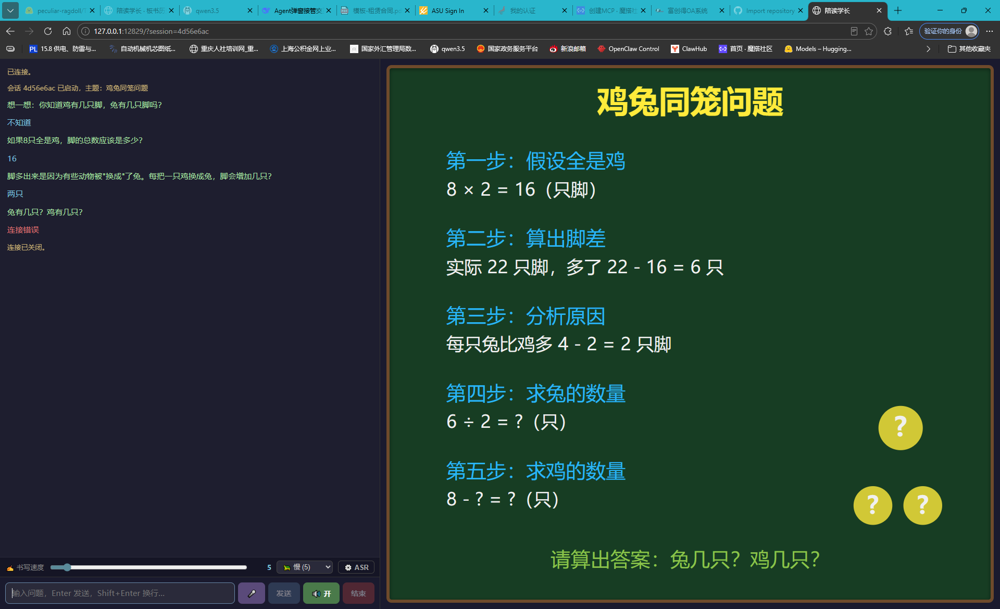

# interactive-mcp

[](https://github.com/coldcat8120/interactive-mcp/actions/workflows/lint.yml)
[](https://opensource.org/licenses/MIT)


[中文](README.zh.md) | **English**


An MCP skill that lets any MCP-capable agent framework **pop up a dedicated blackboard window** — the user watches the board being drawn and asks questions in the same window, powered by a single LLM throughout.



## What It Is

A general-purpose MCP skill providing a "study buddy" style blackboard tutoring experience:

- **Agent-triggered popup**: the browser window opens automatically when the tool is called
- **SVG blackboard**: the LLM generates SVG; the frontend renders it as strokes appearing over time
- **Single LLM**: no second brain anywhere — all reasoning is done by the calling framework
- **LaTeX rendering**: both the board and the chat area render math via KaTeX
- **Streaming strokes with adjustable speed**: the board fills in block by block, speed is user-controllable
- **Voice input / speech output** (optional): ASR / TTS configured by the user; gracefully degrades when unset

## How It Works

```
┌─────────────────────────────┐
│  Agent framework            │
│  (OpenCode / QwenPaw / ...) │
└──────────┬──────────────────┘
           │ MCP tool call
           ▼
┌─────────────────────────────┐
│  interactive-mcp (MCP)      │
│  ┌─────────────────────┐    │
│  │ Broker (aiohttp)    │    │
│  │  - popup + WebSocket│    │
│  │  - streaming push   │    │
│  │  - ASR / TTS proxy  │    │
│  └─────────────────────┘    │
└──────────┬──────────────────┘
           │ WebSocket
           ▼
┌─────────────────────────────┐
│  Popup blackboard window    │
│  - SVG board                │
│  - chat area                │
│  - LaTeX + TTS + ASR        │
└─────────────────────────────┘
```

Three MCP tools form a loop:

```
open_tutoring(topic)
    ↓
show_and_wait(content)  ← push board + block for user input
    ↓  loop
show_and_wait(content)
    ↓
close_tutoring()
```

**Key design**: The blocking nature of an MCP tool is used to "pause" the agent's main loop. The user's input inside the popup becomes the tool's return value, fed back to the agent. So there is only ever one LLM — the one belonging to the calling framework.

## Installation

### 1. Clone and install dependencies

```bash
git clone https://github.com/coldcat8120/interactive-mcp.git
cd interactive-mcp
pip install -r requirements.txt
```

### 2. Register the MCP server

Example for **OpenCode** (`~/.config/opencode/opencode.jsonc`):

```jsonc
{
  "mcp": {
    "my-mcp": {
      "type": "local",
      "command": [
        "python",
        "/absolute/path/interactive-mcp/server.py"
      ],
      "timeout": 3600000
    }
  }
}
```

**Set `timeout` generously** (e.g. 1 hour) — the tool blocks until the user finishes interacting in the popup window.

Any MCP client that supports stdio transport will work.

## Via ModelScope

Found this project on [ModelScope](https://www.modelscope.cn/mcp/servers/coldcat120/interactive-mcp)? You still need to run it locally — this is a **local-only** MCP server.

1. Clone the repo locally:

   ```bash
   git clone https://github.com/coldcat8120/interactive-mcp.git
   cd interactive-mcp
   pip install -r requirements.txt
   ```

2. **Change the `"args"` value in the MCP config shown on ModelScope to an absolute path** pointing to your local `server.py`:

   ```json
   "args": ["C:\\Users\\you\\interactive-mcp\\server.py"]
   ```

3. Paste the modified config into your MCP client (Cherry Studio, Claude Desktop, Cursor, etc.).

See [Installation](#installation) for details.

## Usage

In the agent chat, say:

> Call the `open_tutoring` tool of `my-mcp`, topic: Pythagorean theorem

A new browser window appears in a few seconds, and the tutoring agent starts drawing on the board.

## Configuration (Optional)

Click **`⚙️ Voice`** in the top-right corner of the popup to open the settings panel, which holds both ASR and TTS configuration. All settings live only in browser localStorage — **when unset, features degrade gracefully instead of crashing**.

### 🎤 ASR — Voice Input

Fill in any OpenAI-compatible `/audio/transcriptions` endpoint:

| Service | URL | Model |
|---|---|---|
| Local llama.cpp + Qwen3-ASR | `http://127.0.0.1:8082` | `qwen3-asr` |
| OpenAI Whisper | `https://api.openai.com/v1` | `whisper-1` |
| SiliconFlow / Groq | provider base_url | provider model ID |

Local Qwen3-ASR via llama.cpp:

```bash
llama-server \
  -m Qwen3-ASR-0.6B-Q8_0.gguf \
  --mmproj mmproj-Qwen3-ASR-0.6B-bf16.gguf \
  --port 8082
```

**The broker transcodes browser recordings to 16 kHz mono WAV via ffmpeg** before forwarding, so `ffmpeg` must be on your system (a standalone `ffprobe` on Windows also works).

When unset, clicking 🎤 simply prompts and expands the settings panel — no crash.

### 🔊 TTS — Speech Output

Fill in any OpenAI-compatible `/audio/speech` endpoint:

| Service | URL | Model | Voice |
|---|---|---|---|
| OpenAI | `https://api.openai.com/v1` | `tts-1` | `alloy` / `nova` / … |
| SiliconFlow | `https://api.siliconflow.cn/v1` | `FunAudioLLM/CosyVoice2-0.5B` | `claire` / … |
| Local TTS | `http://127.0.0.1:8083` | provider-dependent | provider-dependent |

**Leave blank to use the browser's built-in SpeechSynthesis** (limited voices but zero setup).

When a server-side TTS is configured it is used first; on failure the browser fallback takes over silently, so tutoring is never interrupted.

## Design Philosophy

### Why "a general agent drives a specialized skill" instead of "a specialized agent"?

The conventional approach wraps an entire tutoring agent into its own process with its own LLM. Problems:

1. **Two brains** — context is broken; the specialized agent can't see the main framework's chat history
2. **Prompt bloat** — the general framework's prompt has to carry pedagogy, SVG rules, etc.
3. **Not portable** — switching frameworks means rewriting everything

This project instead keeps the **MCP server as a window and a pipe only; all LLM reasoning stays with the caller**.

- A single LLM with full context
- Teaching constraints live in the tool descriptions, never polluting the framework prompt
- Plug-and-play with any MCP-capable framework

### Why SVG for the blackboard?

When an LLM generates structured graphics, SVG is the **only format** that simultaneously satisfies:

- Highest LLM familiarity (abundantly present in training data)
- Native browser rendering, no extra engine
- Embeds KaTeX math via `foreignObject`
- Text content can be stripped out for TTS

## Known Limitations

- **Strokes and speech can't be perfectly synchronized**: speech runs at ~5 chars/s, strokes at 100+ chars/s even at the slowest setting. Mitigated by defaulting to a slow stroke rate.
- **SVG `<text>` content is spoken after the element closes**, not character-by-character.
- **Browser TTS voices are limited**: only system-installed voices, quality varies. Configuring a server-side TTS is recommended.
- **KaTeX doesn't handle CJK well**: Chinese inside formulas needs `\text{}` wrapping; the frontend auto-wraps as a fallback.

## Directory Layout

```
interactive-mcp/
├── server.py              # MCP tool definitions (three-tool loop)
├── broker.py              # Resident broker: window + WebSocket + streaming + ASR/TTS proxy
├── requirements.txt       # mcp + aiohttp + httpx
├── LICENSE                # MIT
├── NOTICE                 # Third-party licenses (KaTeX, etc.)
├── docs/
│   └── screenshot.png     # screenshot
└── static/
    ├── index.html         # board + chat + KaTeX + TTS + ASR + speed slider
    └── katex/             # KaTeX assets
```

## Extension Ideas

The underlying pattern — *popup + blocking loop + structured output* — is general. Swap the SVG blackboard for anything else and you get a new skill:

- **Mermaid tutoring**: flowcharts, sequence diagrams
- **Code editor**: live coding with execution
- **3D scenes**: geometry and physics visualization
- **Mind maps**: knowledge unfolding step by step

## Acknowledgements

Inspired by a real blackboard — the teacher writes while explaining, students watch while asking. A rhythm we shouldn't lose in the digital age.

## License

This project is licensed under the [MIT License](LICENSE).

Third-party components are documented in [NOTICE](NOTICE) (including KaTeX).
